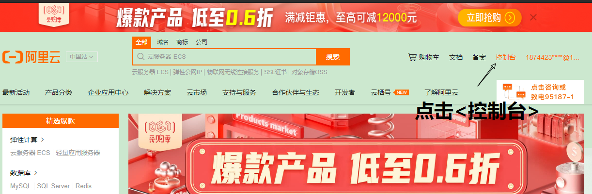

# Docker

# 1 Docker简介

## 1.1 docker介绍


​		**Docker是一种容器技术，解决软件跨环境迁移的问题。**Docker是一个开源项目，诞生于2013年初，最初是dotCloud公司内部的一个业余项目。它基于Google公司推出的Go语言实现。项目后来加入了Linux基金会，遵从了Apache 2.0协议，项目代码在GitHub上进行维护。Docker从17.03版本之后分位CE（Community Edition）和EE（Enterprise Edition）。

**Docker容器的能力**

- 文件系统的隔离：每个容器都有自己的root文件系统
- 进程隔离：每个容器都运行在自己的进程环境中
- 网络隔离：容器间的虚拟网络接口和IP地址都是分开的
- 资源隔离和分组：使用cgroups将CPU和内存之类的资源独立分配给每个Docker容器

## 1.2 dokcer容器虚拟化 vs 传统虚拟化

注意：此部分叫抽象建议最后看

​		在计算机中，虚拟化是一种资源管理技术，是将计算机的各种实体资源，如服务器、网络、内存及存储等，予以抽象、转换后呈现出来，打破实体结构间不可切割的障碍，使用户可以比原本的组态以更好的方式来应用这些资源。在实际的生产环境中，虚拟化技术主要用来解决高性能的物理硬件产能过剩和老的旧的硬件产能过低的重组重用，透明化底层物理硬件，从而最大化的利用物理硬件对资源的充分利用。

容器镜像是将软件打包标准化单元，以用于开发、交付和部署。

- 容器镜像是轻量的，可执行独立软件包，包含软件运行所需的所有内容：代码、运行时环境、系统工具、系统库和设置；
- 容器化软件在任何环境中都能够始终如一地运行；
- 容器赋予了软件独立性，使其免受外在环境差异的影响，从而有助于减少团队间在相同基础设施上运行不同软件是的冲突。


**容器和传统虚拟化的比较**


相同：

- 容器和虚拟机都具有相似的资源隔离和分配优势不同：
- 容器虚拟化的是操作系统，虚拟机虚拟化的是硬件
- 传统虚拟机可以运行不同的操作系统，容器只能运行同一类型操作系统

| 特性       | 容器               | 虚拟机     |
| ---------- | ------------------ | ---------- |
| 启动       | 秒级               | 分钟级     |
| 硬盘使用   | 一般为MB           | 一般为GB   |
| 性能       | 接近原生           | 弱于       |
| 系统支持两 | 单机支持上千个容器 | 一般几十个 |

## 1.3 Docker架构

### 1.3.1 Docker基本架构

  		Docker是一个客户端-服务器（c/s）架构程序。Docker客户端只需要向Docker服务器后台守护进程发出请求，服务器或者守护进程将完成所有工作并返回结果。Docker提供了一个命令行工具Docker以及一整套RESTful API。你可以在同一台宿主机上运行Docker守护进程和客户端，也可以从本地的Docker客户端连接到运行在另一台宿主机上的运程Docker守护进程。


### 1.3.2 Docker基本组件

**1. 镜像（Image）**

​        镜像类似于虚拟机中的镜像，是一个包含有文件系统的面向Docker引擎的只读模板。任何应用程序运行都需要环境，而镜像就是用来提供这种运行环境的。例如一个Ubuntu镜像就是一个包含Ubuntu操作系统环境的模板，同理在该镜像上装上Apache软件，就可以称为Apache镜像。

**2. 容器（Container）**

​        容器类似于一个轻量级的沙盒，可以将其看作一个极简的Linux系统环境（包括root权限、进程空间、用户空间和网络空间等），以及运行在其中的应用程序。Docker引擎利用容器来运行、隔离各个应用。容器是镜像创建的应用实例，可以创建、启动、停止、删除容器，各个容器之间是是相互隔离的，互不影响。注意：镜像本身是只读的，容器从镜像启动时，Docker在镜像的上层创建一个可写层，镜像本身不变。

**3. 仓库（Repository）**

​        仓库类似于代码仓库，这里是镜像仓库，是Docker用来集中存放镜像文件的地方。注意与注册服务器（Registry）的区别：注册服务器是存放仓库的地方，一般会有多个仓库；而仓库是存放镜像的地方，一般每个仓库存放一类镜像，每个镜像利用tag进行区分，比如Ubuntu仓库存放有多个版本（12.04、14.04等）的Ubuntu镜像。      

**4. Registry（注册中心）**

​        Docker用Registry来保存用户构建的镜像。Registry分为公共和私有两种。Docker公司运营公共的Registry叫做Docker Hub。用户可以在Docker Hub注册账号，分享并保存自己的镜像（说明：在Docker Hub下载镜像巨慢，可以自己构建私有的Registry）。

# 2 Docker安装与配置

注意：Docker官方建议在Ubuntu中安装，因为Docker是基于Ubuntu发布的，而且一般Docker出现的问题Ubuntu是最先更新或者打补丁的。在很多版本的CentOS中是不支持更新最新的一些补丁包的。

## 2.1 在centos7.x中安装docker

（1）yum包更新到最新

```bash
sudo yum update
```

（2）安装需要的软件包，yum-utils提高yum-config-manager功能，另外两个是device-mapper驱动依赖的

```bash
sudo yum install -y yum-utils device-mapper-persistent-data lvm2
```

（3）设置yum源为阿里云

```bash
sudo yum-config-manager --add-repo http://mirrors.aliyun.com/docker-ce/linux/centos/docker-ce.repo
```

（4）安装docker

```bash
sudo yum install -y docker-ce
```

（5）安装后检查docker版本

```bash
docker -v
```

## 2.2  配置Docker镜像加速器

默认情况下，从docker hub(https://hub.docker.com)上下载docker镜像，太慢。一般都会配置镜像加速器。

**常用的镜像加速器**

- USTC：中科大镜像加速器（https://docker.mirrors.ustc.edu.cn)
- 阿里云
- 网易云
- 腾讯云

### 2.2.1 阿里云镜像加速器的配置

1. 浏览器输入网址（https://www.aliyun.com/），左击<登录>


2. 选择你的方式进行登录


3. 进入控制台



4. 找到“容器镜像服务”


5. 找到“镜像加速器”


6. 根据操作文档进行配置


### 2.2.2 中科大镜像加速器的配置

编辑文件

```bash
vim /etc/docker/daemon.json
```

在该文件中输入如下内容

```json
{
    "registry-mirrors": ["https://docker.mirrors.ustc.edu.cn"]
}
```

# 3 Docker命令

## 3.1 Docker服务相关命令

`systemctl`命令是系统服务管理指令

- 启动docker服务

```bash
systemctl start docker	
```

- 停止docker服务

```bash
systemctl stop docker
```

- 重启docker服务

```bash
systemctl restart docker
```

- 查看docker服务状态

```bash
systemctl status docker
```

- 设置开机启动docker服务

```bash
systemctl enable docker
```

- 查看docker摘要信息

```bash
docker info
```

- 查看docker帮助文档

```dockerfile
docker --help
```

- 查看docker版本信息

```bash
docker version
或者
docker v
```

## 3.2 Docker镜像相关命令

### 3.2.1 查看镜像

```bash
docker images
docker images -q	# 查看所有镜像的id
```


- `REPOSITORY`:  镜像名称
- `TAG`:  镜像标签
- `IMAGE ID`:  镜像ID
- `CREATED`:  镜像的创建日期
- `SIZE`:  镜像大小

这些镜像都是存储在Docker宿主机的`/var/lib/docker`目录下

### 3.2.2 搜索镜像

从网上查找需要的镜像，可以通过以下命令

```dockerfile
docker search 镜像名称
```


- `NAME`:  仓库名称
- `DESCRIPTION`:  镜像描述
- `STARS`:  用户评价，反应一个镜像的受欢迎程度
- `OFFICIAL`:  是否官方
- `AUTOMATED`:  自动构建，表示该镜像是由Docker Hub自动构建流程创建的

### 3.2.3 拉取镜像

​		从docker仓库下载镜像到本地，镜像名称格式为`<镜像名称:版本号>`，如果不指定版本号，则是最新的版本。如果不知道镜像版本，可以去docker hub搜索对应镜查看。

```bash
docker pull <镜像名称:tag>
```

注意： 如果不加tag，默认使用latest镜像

例如，要下载centos7镜像

```bash
docker pull centos:7
```

### 3.2.4 删除镜像

删除本地镜像

```bash
docker rmi <镜像ID>				# 删除本地指定镜像
docker rmi `docker images -q`	 # 删除本地所有镜像
```

## 3.3 容器相关命令

### 3.3.1 查看容器

★查看正在运行的容器

```bash
docker ps
```

★查看所有容器

```bash
docker ps -a
```

查看最后一次运行的容器

```bash
docker ps -l
```

查看停止的容器

```bash
docker ps -f status=exited
```

### 3.3.2 创建与启动容器

```
docker run <参数>
```

参数说明：

`-i`：保持容器运行。通常与`-t`同时使用，加入`-it`这两个参数后，容器创建后自动进入容器中；**容器退出后，容器自动关闭**。

`-t`：为容器重新分配一个为输入终端，通常与`-i`同时使用。

`-d`：以守护（后台）模式运行容器。创建一个容器在后台运行，需要使用docker exec进入容器。**容器退出后，容器不会自动关闭**。

小结：`-it`创建容器一般称为交互式容器；`-id`创建容器一般称为守护式容器。

`--name`  为创建容器命名

`-v`  表示目录映射关系（**前者**是**宿主机目录**，**后者**是**容器内的目录**），可以使用多个`-v`做多个目录或文件映射。注意：最好做目录映射，在宿主机上做修改，然后共享到容器上

`-p`  表示端口映射，前者是宿主机端口，后者是容器内的映射端口。可以使用多个`-p`做多个端口映射

（1）交互式创建容器

```bash
docker run -it --name=<容器名称:标签> <镜像名称:标签> /bin/bash
```

示例

```bash
docker run -it --name=mycentos centos /bin/bash
```

```bash
exit  # 退出当前容器
```

注意：使用`exit`命令退出，则容器的状态处于Exit，而不是后台运行。想让容器一直运行，而不是停止，**可以使用快捷键 ctrl+p ctrl+q 退出，此时容器的状态为Up**。

（2）守护式创建容器

```bash
docker run -id --name=<容器名称:标签> <镜像名称:标签>
```

示例

```bash
docker run -id --name=mycentos2 centos
```

登录守护式容器方式

- 方式1

```
docker attach <容器名称（或者容器ID）>
```

- 方式2

```bash
docker exec -it <容器名称（或者容器ID）> /bin/bash
```

示例

```bash
docker exec -it mycentos2 /bin/bash
```

### 3.3.3 停止与启动容器

停止容器

```bash
docker stop <容器名称（或者容器ID）>
```

启动容器

```bash
docker start <容器名称（或者容器ID）>
```

### 3.3.4 文件拷贝

如果我们需要将文件拷贝到容器内可以使用`cp`命令

```bash
docker cp <文件或目录> <容器名称:容器目录>
```

示例

```bash
docker cp anaconda-ks.cfg mycentos:/usr/local
```

也可以将文件从容器内拷贝出来

```bash
docker cp <容器名称:容器目录> <文件或目录>
```

示例

```
docker cp mycentos:/usr/local/anaconda-ks.cfg anaconda-ks2.cfg
```

### 3.3.5 查看容器信息

通过以下命令查看容器运行的各种数据

```bash
docker inspect <容器名称（容器ID）>

```

也可以直接执行下面的命令直接输出ip地址

```bash
docker inspect --format='{{.NetworkSettings.IPAddress}}' <容器名称（容器ID）>

```

### 3.3.6 删除容器

删除指定容器

```bash
docker rm 容器名称（容器ID）

```

## 3.4 docker命令总结


# 4 Docker容器的数据卷

## 4.1 数据卷

### 4.1.1 数据卷的介绍


​		数据卷是宿主机中的一个目录或文件；当容器目录和数据卷目录绑定后，对方的修改会立即同步；一个数据卷可以被多个容器同时挂载；一个容器也可以被挂载多个数据卷。

**数据卷的作用**

- 容器数据持久化；
- 外部机器和容器之间通信；
- 容器之间数据交换


​		上图给出了通过2个容器通过挂载同一个数据卷进行数据共享的方式。

### 4.1.2 配置数据卷

​		创建启动容器时，使用`-v`参数设置数据卷

```
docker run ... -v 宿主机目录（或文件）:容器内的目录（文件）...

```

​		示例：创建容器添加`-v`参数，后边为宿主机目录:容器目录

```bash
docker run -id \
-v /usr/local/myhtml:/usr/local/myhtml \
--name=centos_con \
centos_img

```

​		如果挂载的是多级目录，可能会出现权限不足的提示。因为centos7中的安全模块selinux把权限禁掉了，需要添加参数`--privileged=true`来解决挂载的目录没有权限的问题

注意事项：

1. **目录必须是绝对路径**
2. 如果目录不存在，会自动创建
3. 可以挂在多个数据卷

## 4.2 数据卷容器


配置数据卷容器

1. 创建启动c3数据卷容器，使用-v参数设置数据卷

```bash
docker run -it \
--name=c3 \
-v /volume \
centos:7 \
/bin/bash

```

2. 创建启动c1 c2容器，使用--volumes-from参数设置数据卷

```bash
docker run -it \
--name=c1 \
--volumes-from c3 \
centos:7 \
/bin/bash
```

```bash
docker run -it \
--name=c2 \
--volumes-from c3 \
centos:7 \
/bin/bash
```

**小结**：创建一个容器，挂载一个目录；让其他容器继承自该容器（--volume-from）

# 5 应用部署

## 5.1 MySQL部署

（1）拉取mysql镜像

```bash
docker pull mysql
```

（2）创建容器，设置端口映射、目录映射

```bash
docker run -id \
-p 3307:3306 \
--name=c_mysql \
-v $PWD/conf:/etc/mysql/conf.d \
-v $PWD/logs:/logs \
-v $PWD/data:/var/lib/mysql \
-e MYSQL_ROOT_PASSWORD=123456 \
mysql
```

参数说明：

- **端口映射**  `-p 3307:3306`  -->  将容器的3306端口映射到宿主机3307端口
- **配置目录映射**  `-v $PWD/conf:/etc/mysql/conf.d`  --> 将宿主机当前目录下的`conf/`目录挂载到容器的/etc/mysql/conf.d；
- **日志目录映射**  `-v $PWD/logs:/logs`  -->  将主机当前目录下的`logs/`目录挂载到容器的`/logs/`目录；
- 代表端口映射，格式为 `宿主机映射端口: 容器运行端口`
- **数据目录映射**  `-v $PWD/data:/var/lib/mysql`  -->  将主机当前目录下的`data/`目录挂载到容器的`/var/lib/mysql/`目录；
- **初始化root用户密码**  `-e  MYSQL_ROOT_PASSWORD=123456`

（3）进入容器，操作mysql，使用mysql客户端工具连接mysql

```bash
docker exec -it c_mysql /bin/bash

```

- **操作mysql**

```bash
mysql -uroot -p123456	# 进入mysql
show schemas;			# 查看已有数据库
create database db1;	# 创建数据库db1
use db1;				# 使用数据库db1

```

- **使用mysql客户端工具链接mysql**


## 5.2 tomcat部署

（1）拉取镜像

```bash
docker pull tomcat

```

（2）创建容器，设置端口映射、目录映射

```bash
# 再用户目录下创建tomcat目录用于存储tomcat数据信息
mkdir ~/tomcat
cd ~/tomcat

```

```bash
docker run -id \
--name=mytocmcat \
-p 8080:8080 \
-v $PWD:/usr/local/tomcat/webapps \
tomcat

```

参数说明：

- `-p 8080:8080`  --> 将容器的8080端口映射到主机的8080端口
- `-v $PWD:/usr/local/tomcat/webapps` --> 将主机中的当前目录挂在到容器的`webapps`。

（3）使用外部机器访问tomcat

​		在外部主机浏览器中输入网址：`http://<宿主机ip>:<宿主机映射端口号>/<具体文件路径>`


## 5.3 Nginx部署

（1）拉取镜像

```bash
docker pull nginx
```

（2）创建Nginx容器

```bash
dokcer run -id --name=mynginx -p 80:80 nginx
```

（3）将本地静态页面文件拷贝到容器中

```bash
mv dist html  #  将目录文件改名为html
docker cp html mynginx:/usr/share/nginx
```

## 5.4 Redis部署

（1）拉取镜像

```bash
docker pull redis
```

（2）创建容器

```bash
docker run -id \
--name=c_redis \
-p 6379:6379 \
redis
```


# 6 迁移与备份

## 6.1 容器保存为镜像

通过以下命令将容器保存成镜像

```bash
docker commit mynginx mynginx_img
```

或者

```
docker commit -m "centos with git" -a "linzimu" container_id registry_name/centos:git
```

 其中，-m指定说明信息；-a指定用户信息；container_id代表容器的id；registry_name/centos:git指定目标镜像的用户名、仓库名和 tag 信息。 

## 6.2 镜像备份

通过以下命令将镜像保存为tar文件

```bash
docker save -o mynginx.tar mynginx_img

```

## 6.3 镜像恢复与迁移

删除掉mynginx_img镜像，然后执行此命令进行恢复

```bash
docker load -i mynginx.tar

```

`-i`输入的文件

执行后再次查看镜像，可看到镜像已经恢复

# 7 Dockerfile

## 7.1 Docker镜像原理


Linux文件系统有bootfs和rootfs两部分组成

bootfs：包括bootloader（引导加载程序）和kernel（内核）

rootfs：root文件系统包含的就是典型Linux系统中的/dev、/bin、/etc等标准目录和文件

不同的linux发行版，bootfs基本一样，而rootfs不同，如ubuntu，centos等


Docker镜像是由特殊的文件系统叠加而成，最底层的是bootfs，并使用宿主机的bootfs；

第二层是root文件系统rootfs，称为base image，然后再往上可以叠加其他的镜像文件；

统一文件系统（Union File System）技术能够将不同的层整合成一个文件系统，为这些层提供了统一视角，这样就隐藏了多层的存在，在用户看来，只存在一个文件系统。

一个镜像可以放在另一个镜像的上面，位于下面的镜像称为父镜像，最底层的镜像称为基础镜像。

当从一个镜像启动容器时，Docker会在最顶层加载一个读写文件系统作为容器。

**思考**

1. Docker镜像的本质是什么？

   答：是一个分层文件系统

2. Docker中的一个centos镜像为什么只有200+MB，而一个centos操作系统的iso文件要几个G？

   Centos的iso镜像文件包含bootfs和rootfs，而docker的centos镜像复用操作系统的bootfs。

3. Docker中的一个tomcat镜像为什么有500+MB，而一个tomcat安装包只有70+MB？

   答：由于docker中的镜像是分层的，tomcat虽然只有70+MB，但它需要依赖父镜像和基础镜像，所以整个对外暴露的tomcat镜像大小500+MB。

## 7.2 dokcer命令制作镜像


1. 容器转为镜像

   ```bash
   docker commit <容器id> <镜像名称:版本号>
   
   ```

   ```bash
   docker save -o <压缩文件名称> <镜像名称:版本号>
   
   ```

   ```bash
   docker load -i <压缩文件名称>
   
   ```

   **示例**

   ```bash
   docker commit 38182 centos_con:1.0
   
   ```

   ```bash
   docker save -o centos_new_img.tar centos_new_img:1.0
   
   ```

   ```bash
   docker load -i centos_new_img.tar
   
   ```

   注意：容器中通过目录挂载操作的改变不能通过该方式进行保存。

## 7.3 通过Dockerfile制作镜像

### 7.3.1 什么是Dockerfile

Dockerfile是由一系列命令和参数构成的脚本，这些命令应用于基于础镜像创建一个新的镜像。

1. 对于开发人员：可以为开发团队提供一个完全一致的开发环境；
2. 对于测试人员：可以直接拿开发时索构建的镜像或者通过Dockerfile文件构建一个新的镜像开始工作；
3. 对于运维人员：在部署时，可以实现应用的无缝移植。

### 7.3.2 dockerfile常用命令

| 关键字      | 作用                     | 备注                                                         |
| ----------- | ------------------------ | ------------------------------------------------------------ |
| FROM        | 指定父镜像               | 指定dokcerfile基于哪个image构建                              |
| MAINTAINER  | 作者信息                 | 用来标明这个dockerfile谁写的                                 |
| LEBEL       | 标签                     | 用来标明dockerfile的标签，可以使用LABEL代替MAINTAINER。最终都是在docker iamge基本信息中可以查看 |
| RUN         | 执行命令                 | 执行一段命令，默认是/bin/sh。 格式：`RUN command`或者`RUN ["command", "param1", "param2"]` |
| CMD         | 容器启动命令             | 提供启动容器时候的默认命令和ENTRYPOINT配合使用。格式：`CMD command param1 param2`或者`CMD ["command", "param1", "param2"]` |
| ENTRYPOINT  | 入口                     | 一般在制作一些执行就关闭的容器中会使用                       |
| COPY        | 复制文件                 | build的时候复制文件到image中，如果有压缩文件并不能解压       |
| ADD         | 添加文件                 | build的时候添加文件到image中，不仅仅局限于当前build上下文，可以来源于远程服务；如果是一个压缩文件，将会在复制后自动解压 |
| ENV         | 环境变量                 | 指定build时候的环境变量。可以在启动的容器的时候通过-e覆盖。格式：`ENV name=value` |
| ARG         | 构建参数                 | 构建参数，只在构建的时候使用的参数。如果ENV，那么ENV的相同名字的值始终覆盖arg参数 |
| VOLUME      | 定义外部可以挂载的数据卷 | 指定build的image哪些目录可以启动的时候挂载到文件系统中，启动容器的时候使用`-v`绑定。格式：`VOLUME ["目录"]` |
| EXPOSE      | 暴露端口                 | 定义容器运行的时候监听的端口，启动容器时使用`-p`来绑定暴露端口。格式：`EXPOSE 8080`或者`EXPOSE 8080/udp` |
| WORKDIR     | 工作目录                 | 指定容器内部的工作目录。如果没有创建则自动创建；如果指定`/`，使用的是绝对路径；如果不是`/`开头，那么是在上一条workdir的路径的相对路径 |
| USER        | 指定执行用户             | 指定build或者启动的时候用户在`RUN CMD ENTRYPOINT`执行的时候的用户 |
| HEALTHCHECK | 健康检查                 | 指定检测当前容器的健康的命令，基本上没有用，因为很多时候应用本身就有健康检测机制 |
| ONBUILD     | 触发器                   | 当存在ONBUILD关键字额的镜像作为基础镜像的时候，当执行FROM完成之后，会执行ONBUILD的命令，但是不影响当前镜像，用处也不到 |
| STOPSIGNAL  | 发送信号量到宿主机       | 该STOPSIGNAL指令设置将发送到容器的系统调用信号以退出         |
| SHELL       | 指定执行脚本的shell      | 指定`RUN ENTRYPOINT`执行命令的时候使用的shell                |

### 7.3.3 Dokcerfile案例

案例1：

**案例1**：自定义centos7镜像。要求：1.默认登录路径为/usr；2.可以使用vim。

编写centos_dockerfile文件

```bash
mkdir docker-files
cd docker-files
vim centos_dockerfile

```

centos_dockerfile内容

```dockerfile
FROM centos:7								# 定义父镜像
MAINTAINER songlin <2249796403@qq.com>		# 定义作者信息
RUN yum install -y vim						# 执行安装vim
WORKDIR /usr								# 定义默认的工作目录
cmd /bin/bash								# 定义容器启动执行的命令

```

根据Dockerfile构建新的镜像

```bash
docker build -f ./centos_dockerfile -t centos_new_img:1 .

```

**参数**  `-t`指定镜像名称 ， `.`指定dockerfile的文件夹为当前目录；

根据新镜像创建容器

```bash
docker run -it --name=centos_new_con centos_new_img:1

```

**案例2**：定义dockerfile，发布springboot项目

建立dockerfile文件

在本地访问浏览器访问`http:<宿主机ip>:9000`

# 8 服务编排

问题：微服务架构的应用系统中一般包含若干个微服务，每个微服务一般都会部署多个实例，如果每个微服务都要手动管理，维护工作量会很大。

解决方案：按照一定的业务规则批量管理容器。

## 8.1 Docker Compose

​		Docker Compose是一个编排多容器分布式部署的工具，提供命令集管理容器化应用的完整开发周期，包括服务构建、启动和停止。

Docker Compose使用步骤：

1. 利用dockerfile定义运行环境镜像；
2. 使用dokcer-compose.yml定义组成应用的各服务；
3. 运行docker-compose up启动应用

## 8.2 Docker Compose的安装与卸载

**安装**

```bash
# 在安装Compose之前，需要先安装Docker。下面开始安装
sudo curl -L "https://github.com/docker/compose/releases/download/1.25.4/docker-compose-$(uname -s)-$(uname -m)" -o /usr/local/bin/docker-compose
# 设置文件可执行权限
sudo chmod +x /usr/local/bin/docker-compose
# 查看版本信息
docker-compose --version

```

**卸载**

```
# 二进制包方式安装的，删除二进制文件即可
sudo rm /usr/local/bin/docker-compose

```

## 8.3 使用docker compose编排nginx+springboot项目

1. 创建docker-compose目录，编写docker-compose.yml文件

```bash
cd
mkdir docker-compose
cd docker-compose
vim docker-compose.yml

```

docker-compose.yml内容

```yaml
version: '3'
services:
  nginx:
    image: nginx
    ports:
      - 80:80
    links:
      - app
    volumes:
      - ./nginx/conf.d:/etc/nginx/conf.d
  app:
    image: app
    expose:
      - "8080"

```

2. 创建./nginx/conf.d目录

```bash
mkdir -p ./nginx/conf.d

```

3. 在`.nginx/conf.d`目录下编写itheima.conf文件

```bash
cd ./nginx/conf.d
vim itheima.conf

```

itheima文件内容

```shell
server {
	listen 80;
	access_log off;
	
	location / {
		proxy_pass http://app:8080;
	}
}

```

4. 在docker-compse目录下使用docker-compose启动容器

```
cd ../../
docker-compose up

```

5. 测试访问：在本地浏览器访问

```http
http://<宿主机ip>/hello

```

# 8 Docker私有仓库

​		Docker官方的Docker Hub（https://hup.dokcer.com）是一个用于管理公共镜像的仓库，可以从上面拉去镜像到本地，也可以把自己的镜像推送上去。但是，有时候服务器无法访问互联网，或者不希望将自己的镜像放到公网中，那么就需要搭建自己的私有仓库用来存储和管理自己的镜像。

## 8.1 私有仓库搭建与配置

（1）拉取私有仓库镜像

```bash
docker pull registry

```

（2）启动私有仓库容器

```bash
docker run -id --name=registry -p 5000:5000 registry

```

（3）打开浏览器输入地址`http://<私有仓库服务器ip>:5000/v2/_catalog`看到`{"repositories":[]}`表示私有仓库搭建成功并且内容为空

（4）使用私有仓库的宿主机需要需改自己的daemon.json

```bash
vi /etc/docker/daemon.json

```

添加以下内容，保存退出

```json
{"insecure-registries": ["<私有仓库服务器ip>"]}

```

此步用于让docker信任私有仓库地址

（5）重启docker服务

```bash
systemctl restart docker		# 宿主机重启docker
docker start registry			# 启动服务器私有仓库

```

## 8.2 镜像上传至私有仓库

（1）标记此镜像为私有仓库的镜像

```bash
docker tag <镜像名称:tag> <私有仓库服务器ip>:5000/<镜像名称:tag>

```

（2）上传标记的镜像

```bash
docker push <私有仓库服务器ip>:5000/<镜像名称:tag>

```

## 8.3 从私有仓库拉取镜像

```bash
# 拉去镜像
docker pull <私有仓库服务器ip>:5000/<镜像名称:tag>

```

 

### 高级命令参数

`--privileged`参数

大约在0.6版，privileged被引入docker。
使用该参数，container内的root拥有真正的root权限。
否则，container内的root只是外部的一个普通用户权限。
privileged启动的容器，可以看到很多host上的设备，并且可以执行mount。

甚至允许你在docker容器中启动docker容器。

**eg**

```bash
[root@localhost ~]# docker run -t -i --privileged centos:latest bash

```

`--net=host`参数

Docker 中的 host 模式指定是容器与主机享受相同的 network namespace。

host 模式设计出来就是为了性能，但是这却对 docker 的隔离性造成了破坏，导致安全性降低。

在性能场景下，可以用 `--netwokr host` 开启 Host 模式，但需要注意的是，如果你用 Windows 或 Mac 本地启动容器的话，会遇到 host 模式失效的问题。

原因是 **host 模式只支持 Linux 宿主机**。